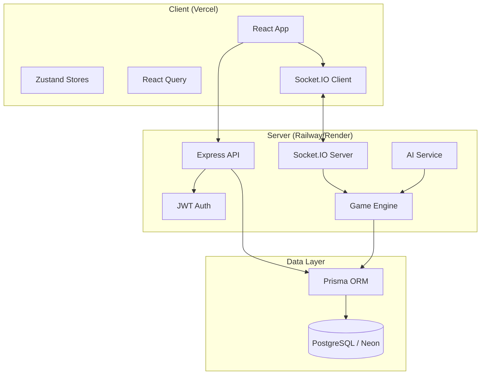

# Architecture

## System Overview



## Feature-Based Folder Structure

### Client (`client/src/`)

```
components/     # Reusable UI (ui/, layout/, game/, lobby/)
pages/          # Route-level page components
stores/         # Zustand state (auth, lobby, game, settings)
services/       # API & socket clients
hooks/          # Custom React hooks
utils/          # Helpers, formatters
types/          # Client-only types
assets/         # SVG cards, sounds, images
animations/     # Framer Motion variants
```

### Server (`server/src/`)

```
config/         # env, database
routes/         # Express route handlers
services/       # Business logic (auth, room, game, ai)
middleware/     # auth, validation, rate limiting
socket/         # Socket.IO event handlers
game/           # UNO game engine (Phase 3)
utils/          # JWT, password, serializers
```

### Shared (`shared/src/`)

```
types/          # DTOs shared between client & server
constants/      # Socket events, API routes, defaults
```

## Real-Time Flow

1. Client connects to Socket.IO with JWT token
2. Client emits `room:join` with room ID
3. Server validates membership, updates connection status
4. Server broadcasts `room:update` to all room members
5. Game actions (Phase 3+) go through server-authoritative engine
6. Server validates every move before broadcasting state

## Security Model

- All game logic runs server-side (anti-cheat)
- JWT access tokens (15min) + refresh tokens (7d)
- Rate limiting on auth and API endpoints
- Input validation with Zod on all endpoints
- Socket events validated server-side
- OpenAI API key never exposed to client

## Deployment

| Service | Platform | Notes |
|---------|----------|-------|
| Frontend | Vercel | Static build from `client/` |
| Backend | Railway / Render | Node.js server |
| Database | Neon PostgreSQL | Serverless Postgres |
