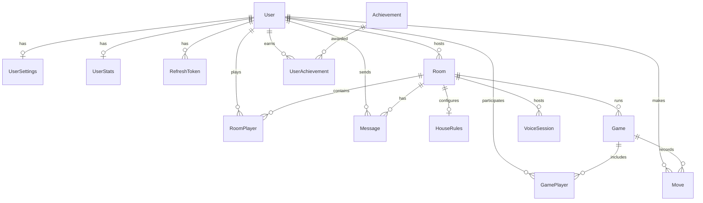

# Database Schema

## Entity Relationship

## Core Tables

### Users
- Authentication (local + Google OAuth)
- Profile (username, avatar, color)

### Rooms
- 6-character join codes
- Host controls, player limits
- Status lifecycle: WAITING → STARTING → IN_PROGRESS → FINISHED

### HouseRules
- One-to-one with Room
- Standard variants (stack +2, jump-in, seven-O, etc.)
- Custom rules stored as JSON array

### Games & Moves
- Full game state persisted as JSON
- Individual moves logged for replay/stats

### Messages
- Chat history (USER, SYSTEM, GAME types)
- Persisted per room

### UserStats
- Wins, losses, streaks, points
- Powers leaderboard queries

## Indexes

- `Room.code` — fast room lookup
- `User.email`, `User.username` — auth queries
- `Message.roomId + createdAt` — chat history
- `UserStats.wins, totalPoints` — leaderboard sorting
